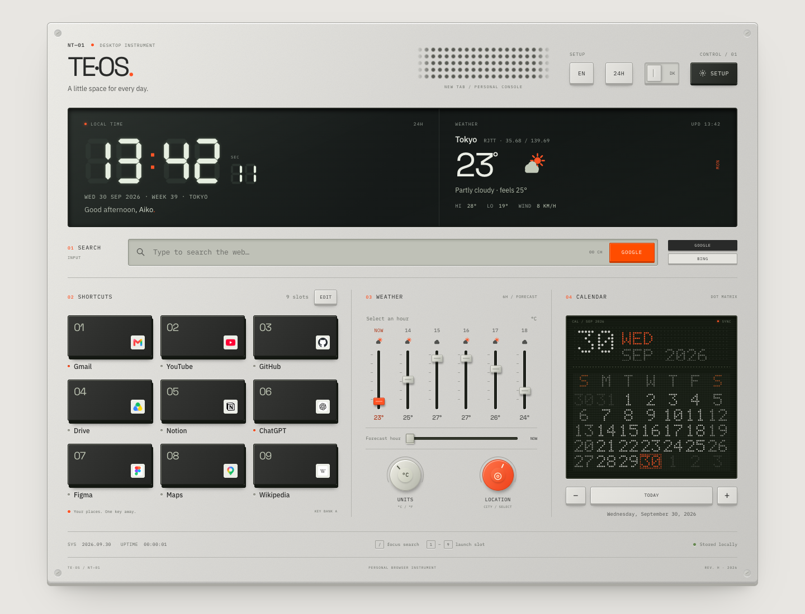
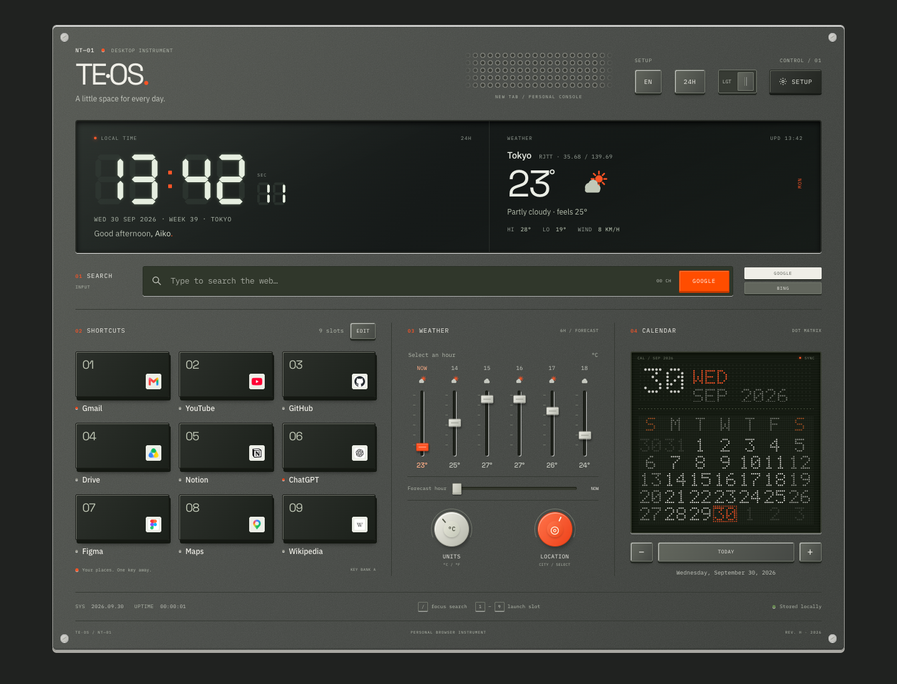

# TE·OS — Desktop Instrument

Chrome 新标签页的硬件面板设计版本。参考 teenage engineering K.O. II 的银色机身、显示屏、按键、推子和旋钮，将搜索、时间、快捷方式、天气和日历组成一台桌面仪器。

A hardware-inspired Chrome new tab. The silver panel, display, keys, faders, and knobs take inspiration from the teenage engineering K.O. II, bringing search, time, shortcuts, weather, and calendar together as a desktop instrument.

## 预览 · Preview

截图的天气使用验证用数据。实际使用时会请求 Open-Meteo。 · Weather in these screenshots uses controlled test data. The installed extension requests Open-Meteo.

## 操作 · Controls

| 部件 · Part | 功能 · Function |
| --- | --- |
| 分段时钟屏 · Segment display | 显示本地时间；24H 按键切换 12/24 小时制。 · Shows local time; the 24H key switches between 12/24-hour formats. |
| 快捷方式按键 · Shortcut keys | 点击打开网站；编辑按钮支持新增、修改和删除，最多 12 个。 · Open a website; Edit lets you add, change, or remove up to 12 shortcuts. |
| 天气推子 · Weather faders | 点击选择未来六个时段之一；推子高度表示这六个时段内的相对温度。 · Select one of six forecast hours; the fader positions show relative temperatures within that forecast. |
| 水平推子 · Horizontal fader | 拖动或使用方向键选择预报时段，顶部屏幕显示对应天气。 · Drag or use arrow keys to choose an hour and view its weather on the display. |
| 白色旋钮 · Light knob | 切换摄氏与华氏温度。 · Switch between Celsius and Fahrenheit. |
| 橙色旋钮 · Orange knob | 打开城市查询与选择。 · Open city lookup and selection. |
| 点阵日历 · Dot-matrix calendar | 点击日期；加减按键切换月份；今天按键返回当天。键盘方向键移动日期，Home 返回今天。 · Click a date, use plus/minus to change months, or Today to return to the current date. Arrow keys move the selected date; Home returns to today. |
| 搜索 · Search | Google/Bing 按键选择引擎；橙色按键提交搜索。 · Choose Google or Bing; the orange key submits a search. |

按 `/` 聚焦搜索，按 `1`–`9` 打开对应快捷方式，按 `Esc` 关闭设置。 · Press `/` to focus search, `1`–`9` to open a shortcut, and `Esc` to close settings.

支持中英文、明暗主题，设置与快捷方式在本机保存。多个标签页会同步快捷方式修改。 · Supports Chinese and English, light and dark themes, and locally saved preferences. Shortcut changes synchronize across tabs.

## 安装 · Install

1. 解压安装包。 · Unzip the package.
2. 打开 Chrome 的 `chrome://extensions` 并开启开发者模式。 · Open `chrome://extensions` and turn on Developer mode.
3. 点击“加载已解压的扩展程序”，选择包含 `manifest.json` 的 `TE-OS-Hardware-New-Tab` 文件夹。 · Click **Load unpacked** and choose the `TE-OS-Hardware-New-Tab` folder containing `manifest.json`.
4. 打开新标签页。 · Open a new tab.

这是 `redesign/hardware-panel` 分支的本地设计预览。 · This is a local design preview from the `redesign/hardware-panel` branch.

## 网络与隐私 · Network and privacy

- 搜索词发送给所选的 Google 或 Bing 搜索引擎。 · Search terms are sent to the selected Google or Bing search engine.
- 城市查询与天气来自 Open-Meteo；服务不可用时已有天气缓存会标记为“缓存”，预设城市的示例数据会标记为“离线”。 · City lookup and weather use Open-Meteo. If the service is unavailable, cached weather is marked CACHE and preset sample weather is marked OFFLINE.
- 网站图标来自 Google Favicon 服务；请求失败时显示名称首字母。 · Website icons use Google's Favicon service, with the name's initial as a fallback.
- 字体随扩展打包，页面设置与快捷方式保存在本地；不包含分析追踪代码。 · Fonts are bundled, preferences and shortcuts stay local, and no analytics tracking code is included.

## 字体与参考 · Fonts and reference

字体使用 IBM Plex Sans、IBM Plex Mono、Space Grotesk、Noto Sans SC，采用 SIL Open Font License。许可文件位于 `assets/fonts/licenses/`。 · Uses IBM Plex Sans, IBM Plex Mono, Space Grotesk, and Noto Sans SC under the SIL Open Font License. License texts are in `assets/fonts/licenses/`.

设计参考：[teenage engineering EP–133 K.O. II](https://teenage.engineering/products/ep-133)。 · Design reference: [teenage engineering EP–133 K.O. II](https://teenage.engineering/products/ep-133).
