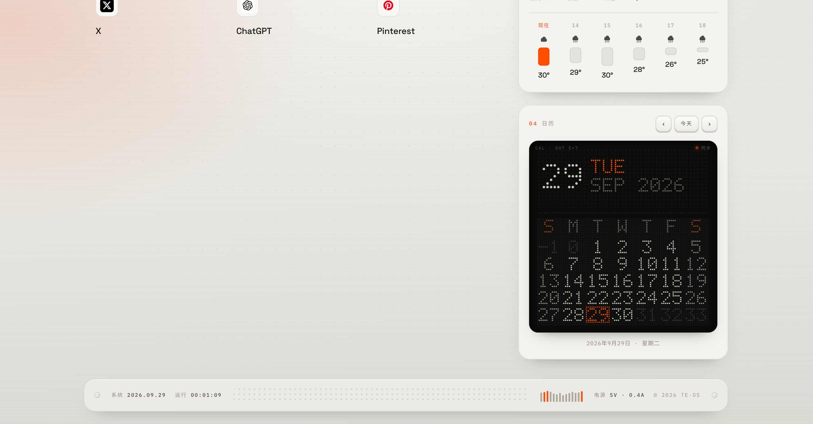

# TE·OS Chrome New Tab

一个以原页面为基础的 Chrome 新标签页扩展，提供搜索、时间、天气、日历和可自定义快捷方式。

A Chrome new tab extension based on the original dashboard, with search, clock, weather, calendar, and customizable shortcuts.

## 截图 · Screenshots

## 功能 · Features

- 搜索引擎可选 Google 或 Bing。 · Choose Google or Bing for search.
- 显示时钟、日期、天气和日历。 · View the clock, date, weather, and calendar.
- 快捷方式支持添加、编辑和删除，最多 12 个；设置保存在当前浏览器中。 · Add, edit, and remove up to 12 shortcuts; preferences stay in the current browser.
- 快捷方式使用网站图标；图标不可用时显示名称首字母。 · Shortcuts use website favicons, with the name's initial as a fallback.
- 支持中英文、摄氏/华氏温度、12/24 小时制和明暗主题。 · Supports Chinese and English, Celsius and Fahrenheit, 12/24-hour time, and light/dark themes.
- 字体随扩展打包，无需在打开新标签页时从 Google Fonts 下载。 · Fonts are bundled with the extension, so Google Fonts does not need to be reached when opening a new tab.

## 安装 · Install

1. 下载或克隆此仓库，并解压（如果下载的是 ZIP）。 · Download or clone this repository and unzip it if needed.
2. 在 Chrome 地址栏打开 `chrome://extensions`。 · Open `chrome://extensions` in Chrome.
3. 开启右上角的“开发者模式”。 · Turn on **Developer mode**.
4. 点击“加载已解压的扩展程序”，选择仓库中的 `TE-OS-Chrome-New-Tab` 文件夹。 · Click **Load unpacked** and select the `TE-OS-Chrome-New-Tab` folder.
5. 打开新标签页即可使用。 · Open a new tab to use the extension.

此扩展使用 Chrome Manifest V3，不需要构建步骤。 · This extension uses Chrome Manifest V3 and requires no build step.

## 自定义快捷方式 · Customize shortcuts

在快捷方式区域点击“编辑”，即可新增或删除条目，并修改名称和网址。最多可保存 12 个快捷方式。输入网址时可以省略 `https://`。

Click **Edit** in the shortcuts area to add or remove entries and change their names and URLs. Up to 12 shortcuts are supported. You can omit `https://` when entering a URL.

## 网络请求与隐私 · Network and privacy

- 搜索词会发送给当前选择的搜索引擎（Google 或 Bing）。 · Search terms are sent to the selected search engine (Google or Bing).
- 天气和城市查询使用 Open-Meteo。 · Weather and city lookups use Open-Meteo.
- 网站图标通过 Google Favicon 服务获取。 · Website favicons are fetched through Google's Favicon service.
- 快捷方式和页面设置保存在本机浏览器中；扩展不包含分析追踪代码。 · Shortcuts and page preferences are stored in the local browser; the extension contains no analytics tracking code.

## 字体许可 · Font licenses

随扩展提供的字体采用 SIL Open Font License，许可文件位于 `assets/fonts/licenses/`。 · Bundled fonts are licensed under the SIL Open Font License; the license texts are in `assets/fonts/licenses/`.
